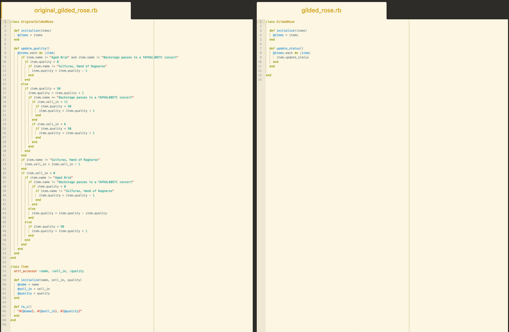

# Gilded Rose Refactoring Kata

A fully TDD driven Ruby solution to the Gilded Rose Refactoring Kata, based on [Emily Bache's multi-language translation of the original C# problem](https://github.com/emilybache/GildedRose-Refactoring-Kata).

The Gilded Rose kata is an exercise in refactoring a client's legacy code to preserve existing functionality and allow for simple extendability. The client in this case is a fantasy-world tavern called the Gilded Rose, which needs their inventory system updated to accommodate a new type of item they wish to sell. The full details of the requirements can be found [here](./GildedRoseRequirements.txt).

Install
-----

1. Create a new directory on your local machine.

2. `git clone` the repo into the directory.

3. Run `bundle install` to install dependencies.

Walkthrough
-----

Run `rpsec` for unit testing.

The original legacy code can be seen in the `./lib/original_gilded_rose.rb` file, and can be run by using `ruby texttest_feature_legacy.rb`. The output generated has been saved in `text_tests/golden_master.txt`. Note that that the Conjured item functionality has not been implemented on this code.

The newly refactored code, including the functional Conjured item class, can be run using `ruby texttest_feature_refactor.rb`. The output has been saved in `text_tests/refactor_master.txt`. You can compare the output using [Diff Checker](https://www.diffchecker.com/).

Screenshot
-----

Comparison of original with refactored Gilded Rose class.

